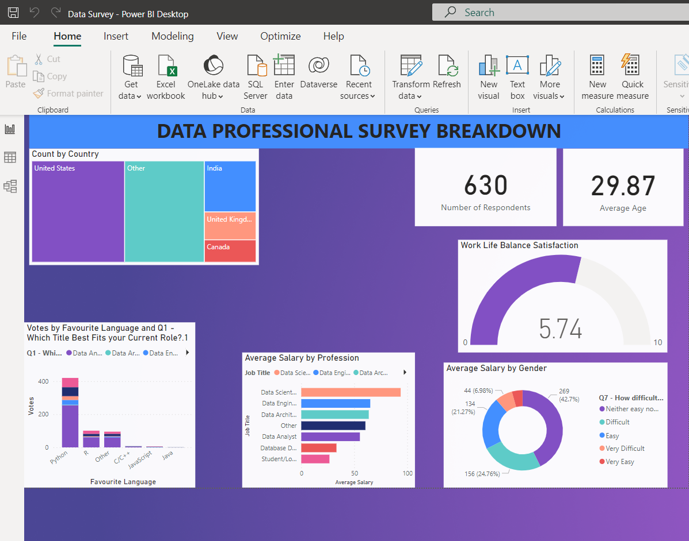

# Countdown-Timer-using-Python
I have created a dashboard from an online survey. Firstly I have cleaned the data using Power Bi and made it suitable to make a dashboard. Then , I have used various types like pie charts and bar graphs to showcase the various data fields
  
  
  

## Requirements
* Excel
* Power Bi
